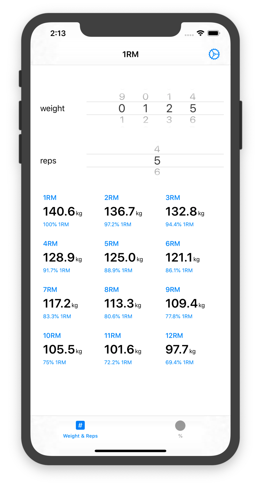
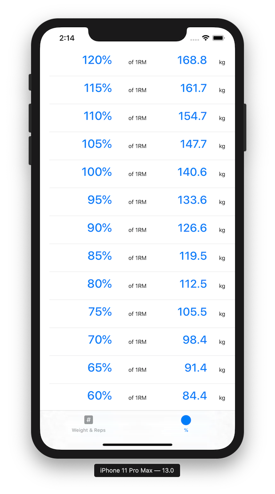

#  1RM

One repetition maximal calculator for iOS

 

## License

Copyright &copy; 2020 [Oliver Lau](mailto:oliver@ersatzworld.net)

This program is free software: you can redistribute it and/or modify it under the terms of the GNU General Public License as published by the Free Software Foundation, either version 3 of the License, or (at your option) any later version.

This program is distributed in the hope that it will be useful, but WITHOUT ANY WARRANTY; without even the implied warranty of MERCHANTABILITY or FITNESS FOR A PARTICULAR PURPOSE.  See the GNU General Public License for more details.

You should have received a copy of the GNU General Public License along with this program. If not, see [http://www.gnu.org/licenses/](http://www.gnu.org/licenses/).

---

Dieses Programm ist freie Software. Sie können es unter den Bedingungen der [GNU General Public License](http://www.gnu.org/licenses/gpl-3.0), wie von der Free Software Foundation veröffentlicht, weitergeben und/oder modifizieren, entweder gemäß Version 3 der Lizenz oder (nach Ihrer Wahl) jeder späteren Version.

